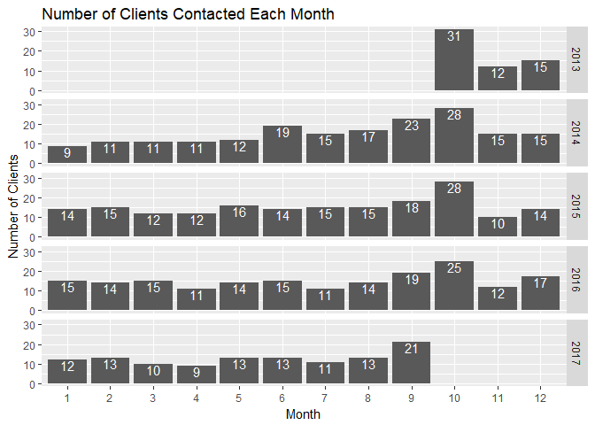

In this project, I will decide a month which is the best to anounce an upgrade. Since this project is to determine a month for announcement based on a small dataset with 1001 rows of data between October 2013 and September 2017, I will not use regression or machine learning for predictions, which may require more data for the accuracies of result. I will first use data exploration to go over the dataset to see if we can find out an oustanding month intuitively. If no months could be found, I will use hypothesis and regression to find out a month with high correlations with clients and contacts.

In this datase, we have 4 managers and 35 clients. The data is from October 2013 to September 2017. To roughly find out the month, I will use data visualization most of the time to find out the trends, from which the month could be found hopefully.

Before we dig into the data, I set up three criteras for the best month for announcement: - A high number of contacts - A high number of clients getting contacted - The prediction is predictable and reliable

At first, I will take a glance at the frequency of contacts made in the dataset.

From the graph, we can see the data started from October 2013 to September 2017. Based on the trend, we can see October has the most contacts, but we still don't know if this trend will be the same in the future.

Five trends above show the contacts in five years between 2013 and 2017. We can see October always stayed the eak from 2013 to 2016. We can see the trend of September going up as well. However, we can also discover that the number of contacts in the peak, October, is going down by year from 2013, though it does not affect the fact that the number of contacts in that month is the highest among a year. From the graph above, we can roughly say the trend of contacts for a year is relatively stable and it is predictable for the peak in a year. Based on the analysis above, I generate a average line to show the trend of the number of contacts by months.

So now we know October has the highest contacts. However, we need to inform most clients instead of making more contacts. We need to make sure these contacts cover as many clients as possible.

First of all we need to make sure all clients are all involved from 2013 to 2016. The table below shows the number of contacts clients received around a year from 2013 to 2017.

    ##                            Client.Name 2013 2014 2015 2016 2017
    ## 1                         Abbott Group    2    9    8    6    6
    ## 2            Anderson, Kutch and Hyatt    1    5    7    9    2
    ## 3                      Armstrong Group    2   10    5    3    5
    ## 4                          Bosco-Ortiz    1    9    5    7    1
    ## 5              Brown, Wyman and Grimes    5    8   11    4    7
    ## 6                          Cormier LLC    1    7    6    8    2
    ## 7            Denesik, Stehr and Carter    4    9    6    9    5
    ## 8                    Donnelly-Champlin    6    9   11    7    2
    ## 9                    Eichmann and Sons    3   11    8    8    8
    ## 10         Fahey, Wunsch and Bashirian    3    6    8    7   10
    ## 11                       Franecki-Feil    2    6    9    8    4
    ## 12                         Hagenes Inc    1    8    4    4    6
    ## 13                       Halvorson LLC    2    8    8    8    5
    ## 14                         Hauck Group    3    4    7    4    2
    ## 15 Hermiston, Armstrong and Balistreri    2    7    7    9    5
    ## 16                          Hoppe-Batz    1    6    8    8    6
    ## 17                    Johnston-Schaden    5    7    8   11    2
    ## 18                            Koss Inc    4    6    5    6    3
    ## 19          Kris, Shanahan and Quigley    3    9    7    8    2
    ## 20            Kuhic, Stark and Kreiger    5    4    3    8    4
    ## 21                  Lemke-Pfannerstill    1   11    5    7    4
    ## 22         Lindgren, Graham and Spinka    4    7   11    3    3
    ## 23           Lueilwitz, Moore and Hahn    4    3    4    6    3
    ## 24       Medhurst, Ankunding and Wolff    3   13   10    5    5
    ## 25                   Mitchell and Sons    1   12    7    8    7
    ## 26       Oga, Gottlieb and Cruickshank    1    5    8    5    6
    ## 27                      Ondricka-Wolff    5    9    8    6    2
    ## 28            Orn, Russel and O'Reilly    2    8    6    5    4
    ## 29                    Sanford and Sons    2    6    4    7    5
    ## 30                        Stamm-Crooks    6   11    7    8    3
    ## 31        Thompson, Howell and Hegmann    1   10    8    7    2
    ## 32                         Trantow Inc    3    2    6    5    2
    ## 33          Veum, McClure and Schuster    2    7    5    9    7
    ## 34                          Walter Inc    4    8    7   12    1
    ## 35             Wyman, Farrell and Haag    4    4   14    5    6

All clients are contact at least once around a year from 2013 to 2017, even though 2013 has 3 months and 2017 has 9 months in record.

I made a list for contacted clients in each month shown below. 

We have 35 clients in total. In order to contact the most clients, we need to find out a month that has the most distinct clients getting contacted. October is the month that has the most different clients getting contacted around the year from 2013 to 2016. In terms of the number of contacted clients over a year, October is still the best month for announcements.

Last but not least, we need to make sure four account managers are reliable, so we can have a higher confidence for the month we pick.

These four managers have similar working loads around the year and all have relatively high loads on Septembers and Octobers. From four years, their contacts are relatively stable, due to the lower number of outliers, marked as red, in the graph. Their works are preditable.

From all the discussions above, we can find out that from 2013 to 2016, - the number of contacts has a trend around a year, and October has the most - all 35 clients were active and the distributions of the number of contacted clients among years are similar and October has the most clients getting contacted. - Account managers' working loads are stable through the years between 2013 and 2017

Based on the data exploration above, I would say October is a good choice for making anouncement.
